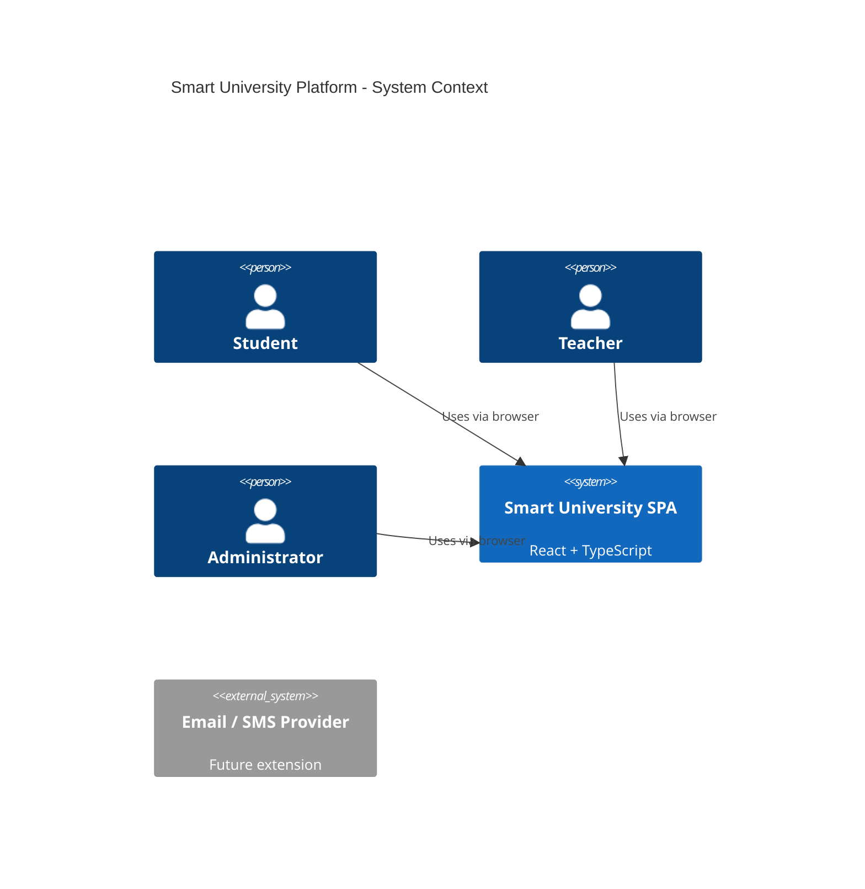
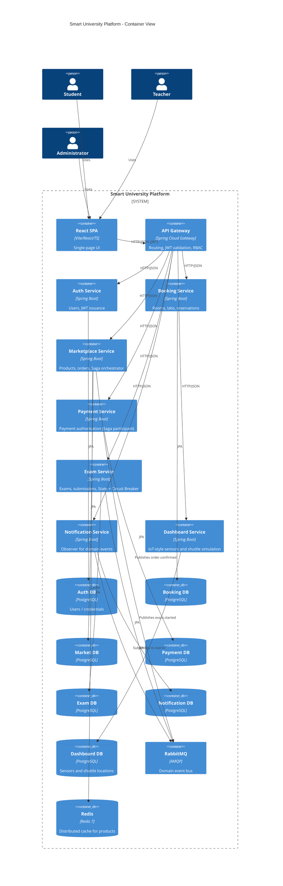
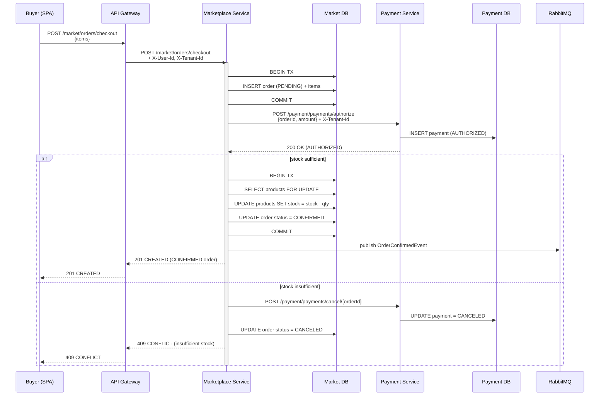
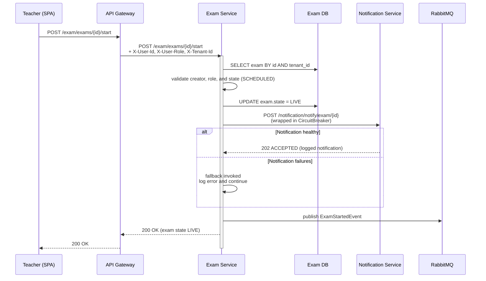
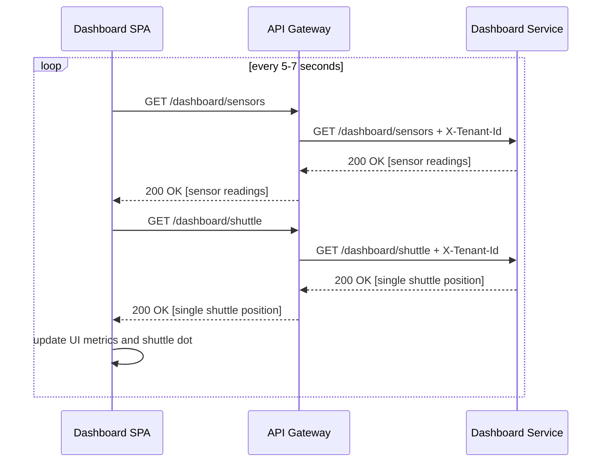

# Architecture Overview

This document provides a high-level architectural view of the Smart University Microservices Platform using C4-style abstractions and highlights the key patterns in use.

## C1 – System Context

The Smart University Platform is a system used by students, teachers, and administrators to manage resources, exams, marketplace transactions, and live campus information.



## C2 – Containers

The system is decomposed into an API Gateway, multiple Spring Boot microservices, a React SPA, PostgreSQL databases, and RabbitMQ.



## Key Cross-Cutting Concerns

### Security

- **JWT** tokens issued by `auth-service` are validated centrally in `gateway-service`.
- Roles (`STUDENT`, `TEACHER`, `ADMIN`) and tenant id are encoded in JWT and propagated via headers:
  - `X-User-Id`, `X-User-Role`, `X-Tenant-Id`.
- Backend services trust only gateway-injected headers and do not parse JWTs directly.

### Multi-Tenancy

- Each microservice maintains its own database schema with a `tenant_id` column on tenant-bound tables.
- Tenant id is taken from `X-Tenant-Id` and is mandatory for multi-tenant endpoints.
- No cross-tenant access is allowed; e.g. Marketplace forbids using a product from another tenant.

### Reliability and Patterns

- **Saga pattern**  
  Marketplace orchestrates a Saga for checkout:
  1. Create `PENDING` order.
  2. Call Payment Service to authorise.
  3. Decrement stock with pessimistic locking and confirm order.
  4. On payment failure or stock issues, cancel order and compensate payment.

- **State pattern**  
  Exam lifecycle is modeled as:
  - `DRAFT`, `SCHEDULED`, `LIVE`, `CLOSED`
  - State objects encapsulate behaviour:
    - e.g. `ScheduledExamState.start()` transitions exam to `LIVE`.
    - Only `LIVE` accepts submissions.

- **Circuit Breaker (Resilience4j)**  
  Exam Service wraps HTTP calls to Notification Service in a `notificationCb` circuit breaker:
  - If notifications fail or the circuit is open, exam start still succeeds.
  - Failures are logged, and an `ExamStartedEvent` is still produced.

- **Observer / Event-Driven**  
  Services emit events to RabbitMQ:
  - `market.order.confirmed` (from Marketplace)
  - `exam.exam.started` (from Exam Service)
  - Notification Service subscribes and persists `NotificationLog` entries.

---

## C3 – Component Sketches

### Auth Service (auth-service)

Main components:

- `User` entity and `UserRepository`.
- `AuthService` for register/login.
- `JwtService` for JWT creation and validation.
- `AuthController` exposing `/auth/register` and `/auth/login`.

### Marketplace & Payment (Saga)

- Marketplace:
  - `Product`, `Order`, `OrderItem` entities.
  - `OrderSagaService` orchestrating:
    - Order creation.
    - Payment via `PaymentClient`.
    - Stock decrement with optimistic business checks and pessimistic DB locks.
    - Compensation on failure.
  - `MarketplaceController` for `/market/products` and `/market/orders/checkout`.

- Payment:
  - `Payment` entity, `PaymentRepository`.
  - `PaymentStrategy` interface + `MockPaymentStrategy`.
  - `PaymentService` + `PaymentController` for authorisation and cancellation.

### Exam & Notification (State + Circuit Breaker + Observer)

- Exam:
  - `Exam`, `Question`, `Submission` entities.
  - `ExamState` interface and `DraftExamState`, `ScheduledExamState`, `LiveExamState`, `ClosedExamState`.
  - `ExamStateFactory` to obtain behaviour from `ExamStateType`.
  - `NotificationClient` using Resilience4j Circuit Breaker.
  - `ExamService` orchestrates lifecycle, submissions, and event publication.
  - `ExamController` handling `/exam/exams` and `/exam/exams/{id}/start|submit`.

- Notification:
  - `NotificationLog` entity, `NotificationLogRepository`.
  - `NotificationService` persisting logs.
  - `NotificationMessagingConfig` + `NotificationListeners` to bind queues and handle incoming events.
  - `NotificationController` for direct HTTP-based notifications.

---

## Frontend SPA

- **React + TypeScript + Vite** SPA consuming the API Gateway:
  - AuthContext manages JWT and tenant id, syncing with localStorage.
  - Axios client automatically injects `Authorization` and `X-Tenant-Id` headers.
  - Pages:
    - **Login / Register** – flows against Auth Service.
    - **Dashboard** – polling `dashboard-service` sensors and shuttle data.
    - **Booking** – lists resources and allows ad-hoc reservation creation.
    - **Marketplace** – lists products and performs a “quick checkout” against the Saga.
    - **Exams** – teacher demo to create and start exams (triggering CB + Observer flows).

---

## Non-Functional Requirements Mapping

- **Scalability**:
  - Stateless services behind the API Gateway.
  - Separate databases allow independent scaling and data isolation.
- **Reliability**:
  - Saga patterns for cross-service consistency.
  - Circuit Breakers to isolate failures.
  - Pessimistic locking and transactional checks for overbooking and stock.
- **Security**:
  - Central JWT validation; strict header-based trust.
  - RBAC enforced at gateway and service layers.
- **Maintainability**:
  - Clear service boundaries with ADRs.
  - State, Strategy, and Observer patterns reduce conditional complexity.
  - Integration tests for key workflows (checkout, bookings, exams).

For deeper decision context, see the ADRs under `docs/adrs/`.

---

## Sequence Diagrams

This section provides sequence diagrams for key workflows: booking (no overbooking), marketplace Saga, exam start with Circuit Breaker, and dashboard refresh.

### Booking Workflow (No Overbooking)

```mermaid
sequenceDiagram
    participant User as Student (SPA)
    participant GW as API Gateway
    participant BS as Booking Service
    participant BDB as Booking DB

    User->>GW: POST /booking/reservations<br/>{resourceId, startTime, endTime}
    GW->>BS: POST /booking/reservations<br/>+ X-User-Id, X-Tenant-Id

    activate BS
    BS->>BDB: BEGIN TX
    BS->>BDB: SELECT reservations WHERE<br/>resourceId = ? AND tenant_id = ?<br/>AND endTime > startTime<br/>AND startTime &lt; endTime<br/>(FOR UPDATE)
    alt overlapping reservations found
        BDB-->>BS: rows with overlaps
        BS-->>GW: 409 CONFLICT (resource already reserved)
        GW-->>User: 409 CONFLICT
    else no overlaps
        BDB-->>BS: empty result
        BS->>BDB: INSERT new reservation (CREATED)
        BS->>BDB: COMMIT
        BS-->>GW: 201 CREATED + reservation DTO
        GW-->>User: 201 CREATED
    end
    deactivate BS
```

### Marketplace Checkout Saga



### Exam Start with Circuit Breaker + Notification



### Dashboard Data Refresh



These diagrams complement the C4 views by showing *runtime* behaviour for the most important workflows.